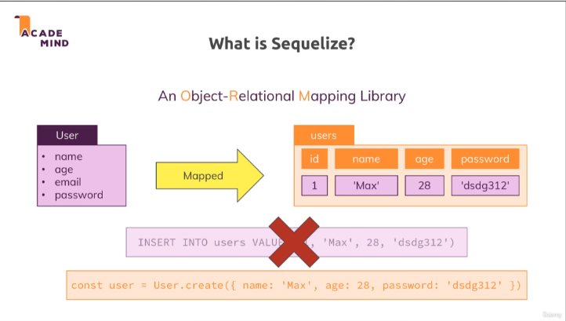
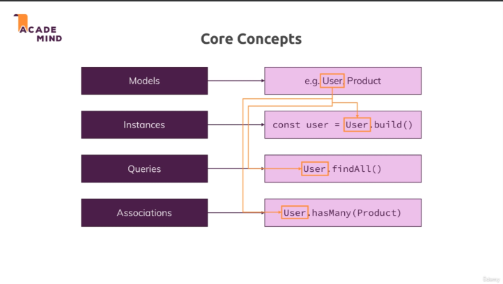

# Section 11: Understanding Sequelize

## **Lesson 151: What is Sequelize?**

- [Udemy](https://www.udemy.com/course/nodejs-the-complete-guide/learn/lecture/11738998#overview)
- [Udemy - schema - what-is-sequelize](images/schema-what-is-sequelize.png)
- [Udemy - schema - core-concepts](images/schema-core-concepts.png)

---

### **Objective**

In this lesson, you’ll gain a deeper understanding of Sequelize, its role in database management, and how it simplifies working with relational databases in Node.js.

---

### **What is Sequelize?**

Sequelize is a promise-based **ORM (Object Relational Mapping)** library for Node.js that works with relational databases like PostgreSQL, MySQL, MariaDB, SQLite, and SQL Server.

<div style="text-align:center">

</div>

<div style="text-align:center">

</div>

---

### **Key Features of Sequelize**

1. **Database Abstraction**:

   - Write database queries using JavaScript methods instead of raw SQL.
   - Example:
     ```javascript
     Product.findAll();
     ```

2. **Cross-Database Support**:

   - Compatible with multiple SQL database systems.
   - Switching databases requires minimal changes.

3. **Model Definitions**:

   - Map database tables to JavaScript classes (called **models**).
   - Example:
     ```javascript
     const Product = sequelize.define("Product", {
       name: Sequelize.STRING,
       price: Sequelize.FLOAT,
     });
     ```

4. **Built-In Validations**:

   - Add validations to models to ensure data integrity.
   - Example:
     ```javascript
     price: {
       type: Sequelize.FLOAT,
       allowNull: false,
       validate: {
         min: 0
       }
     }
     ```

5. **Relationships**:

   - Define and manage relationships like one-to-many and many-to-many between tables.
   - Example:
     ```javascript
     User.hasMany(Product);
     Product.belongsTo(User);
     ```

6. **Transactions**:

   - Manage complex operations with transactional support.

7. **Migration Support**:
   - Allows you to version-control database changes.

---

### **How Does Sequelize Work?**

1. **Database Connection**:

   - Connect to your database using a Sequelize instance.

2. **Model Definition**:

   - Define models for your database tables.

3. **Querying the Database**:

   - Use built-in methods to perform CRUD operations.
   - Example:
     ```javascript
     const products = await Product.findAll();
     ```

4. **Relationship Management**:
   - Define associations between models to represent table relationships.

---

### **Sequelize vs Raw SQL**

| Feature            | Sequelize                               | Raw SQL                                             |
| ------------------ | --------------------------------------- | --------------------------------------------------- |
| **Ease of Use**    | Simplifies operations with JavaScript.  | Requires writing SQL queries manually.              |
| **Readability**    | Code is more readable and maintainable. | SQL logic embedded in code can be harder to follow. |
| **Cross-Database** | Supports multiple databases seamlessly. | Requires adapting SQL syntax for each database.     |
| **Performance**    | Slightly slower due to abstraction.     | Faster, but requires more effort to optimize.       |

---

### **Why Use Sequelize in the Shop Project?**

1. **Simplified Queries**:
   - Fetching products, adding users, and managing relationships is easier.
2. **Relationship Handling**:

   - Managing relationships between users, products, and orders is straightforward.

3. **Scalability**:

   - Easier to add features like cart and order management.

4. **Maintainability**:
   - Cleaner and more modular code.

---

### **Next Steps**

In the next lesson, you’ll set up Sequelize in your Node.js project and connect it to the PostgreSQL database.

---

Are you ready to move on to **Lesson 152: Connecting to the Database**? 🚀
